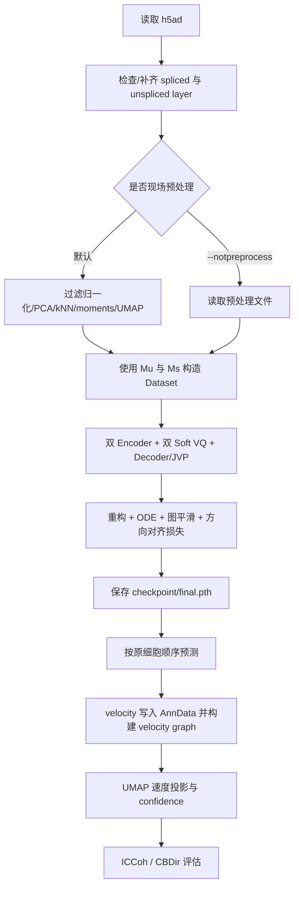

# GFG 项目代码逻辑梳理

## 1. 项目定位

GFG 是一个面向单细胞 RNA velocity 的实验性项目。它以 `AnnData` 中的 unspliced/spliced 表达矩阵为输入，通过两个编码器分别学习“细胞状态流形”和“潜在速度”，再使用软向量量化码本、状态解码器及解码器的 Jacobian-vector product（JVP）把潜在速度映射回基因表达空间。训练过程中同时施加表达重构、RNA 动力学 ODE、邻域速度平滑和速度方向对齐约束。

当前默认入口是 `train.py`，默认选择 `MouseBrain.h5ad`（数据列表下标 `data_index = 2`）。训练完成后，代码将预测的 spliced 速度写入 `adata.layers["velocity"]`，调用 scVelo 构建 velocity graph、投影到 UMAP，并计算 velocity confidence、ICCoh 和 CBDir。

本文依据当前目录内源码进行静态梳理。当前快照不包含数据目录、依赖清单或可用 checkpoint，因此没有执行完整训练。

## 2. 目录与文件职责

```text
GFG/
├── train.py                 # 主入口：读取数据、训练、预测、评估
├── preprocessing.py         # AnnData 加载、layer 修复、scVelo 预处理
├── cbdir_eval.py            # 一套独立/重复的 CBDir、ICCoh 实现
├── plot_data.py             # 预处理前后的 u-s 分布及 cluster 边可视化
├── run.sh                   # 旧环境/旧路径下的启动命令
├── model/
│   ├── Config.py            # 数据、模型、训练超参数和随机种子
│   ├── dataset.py           # AnnData -> PyTorch Dataset
│   ├── Encoder.py           # 每基因 MLP + 基因间 Transformer 编码器
│   ├── Codebook.py          # 共享软向量量化码本
│   ├── Decoder.py           # 状态解码、JVP 速度映射、ODE 残差
│   └── model.py             # VeloModel、训练循环、保存/推理
├── tool/
│   ├── Loss.py              # 重构、邻域平滑和方向对齐损失
│   ├── utils.py             # 推理回填 AnnData、隐空间、加载模型等
│   ├── evaluate.py          # coherence、ICCoh、CBDir 等评估
│   └── plot.py              # 速度流、损失、码本、PAGA 风格绘图
├── const/
│   ├── cluster_edges.py     # 各数据集的已知 cluster 发育方向
│   └── save_config.py       # 一份配置片段；当前不是合法 Python 模块
└── checkpoint/              # 默认模型输出目录（当前为空）
```

## 3. 主流程



### 3.1 参数解析与数据选择

`train.py` 支持三个参数：

| 参数 | 当前实际行为 |
|---|---|
| `--draw` | 仅被解析，后续没有使用，不会触发绘图 |
| `--load_model_path PATH` | 跳过训练，将 `state_dict` 加载到按当前数据维度新建的模型 |
| `--notpreprocess` | 使用 `action="store_false"`；不传时现场预处理，传入时读取 `data/preprocessed/...` |

默认数据集固定为 `MouseBrain.h5ad`。`const/cluster_edges.py` 为多个数据集保存了已知发育边，例如 MouseBrain 中的 `RG, Astro, OPC -> IPC`，这些边只在训练后的 CBDir 评估中使用，不参与模型训练。

### 3.2 数据读取与预处理

`preprocessing.load_data()` 使用 Scanpy 读取 `.h5ad`，打印 `obs`、`obsm` 和 `layers` 信息，然后调用 `check_layers()`：

- 若不存在 `spliced`，但同时存在 `labeled_spliced` 和 `unlabeled_spliced`，则两者相加得到 `spliced`。
- `unspliced` 同理。
- 不会检查最终是否一定存在所需 layer，也不会自动生成 `Ms`/`Mu`。

默认现场预处理由 `preprocess_data_scv()` 完成：

1. 删除重复细胞。
2. 以 `min_shared_counts=20` 过滤并归一化。
3. 计算 30 维 PCA。
4. 构建 kNN 图，默认配置中 `n_neighbors=20`。
5. 通过 `scv.pp.moments()` 生成平滑后的 `Ms` 和 `Mu`。
6. 计算 UMAP。
7. 将邻居索引写入 `adata.uns["neighbors"]["indices"]`。

`train.py` 现场预处理时传入 `n_top_genes=None`，因此不会按 `Config.num_top_gene=2000` 选取 top genes；最终基因数以预处理后的 `adata.n_vars` 为准。

### 3.3 Dataset 与输入布局

主流程显式使用：

```python
Data(adata, spliced_key="Ms", unspliced_key="Mu")
```

因此模型实际学习的是邻域平滑后的 moments，而不是原始 `spliced`/`unspliced` layer。每个样本的布局为：

```text
x = concat([Mu, Ms])，形状为 (2G,)
```

其中 `G` 是基因数。Dataset 还分别统计 `Mu` 和 `Ms` 的逐基因均值、标准差，供编码和解码时 z-score/反 z-score 使用。

若 `adata.obs["is_root"]` 不存在，Dataset 会把 `u/(u+s)` 最高的 50 个细胞标为 root；但训练循环只是读出 `is_root`，没有把它用于任何损失或采样，所以 root 标记当前不会影响结果。

Dataset 会把稀疏 layer 整体转成稠密 NumPy 数组。数据量较大时，这会成为显著的内存开销。

## 4. 模型结构与张量流

默认主要超参数：

| 项目 | 值 |
|---|---:|
| 每基因隐向量维度 `D` | 8 |
| 每个码本的 code 数 `K` | 32 |
| Encoder/Decoder MLP hidden | 256, 512, 512, 256 |
| batch size | 128 |
| epoch | 10 |
| 基础学习率 | 1e-3 |

完整前向流程如下：

```text
输入 x: (B, 2G)
  ├─ manifold_encoder ─> z_manifold: (B, G, D)
  │                       └─ manifold_codebook ─> z_s: (B, G, D)
  └─ velocity_encoder ──> z_velocity: (B, G, D)
                          └─ velocity_codebook ─> z_v: (B, G, D)

z_s 展平为 (B·G, D) ──> 状态解码器 g ──> (u_hat, s_hat)
z_v 展平为 (B·G, D) ──> J_g(z_s) · z_v ──> (v_u, v_s)
```

### 4.1 双编码器

两个 `Encoder` 结构相同但参数独立：

1. 将 `(B, 2G)` 拆成 `u` 和 `s`，按 Dataset 统计量逐基因标准化。
2. 堆叠成 `(B, G, 2)`，即每个基因由一对 `(u, s)` 描述。
3. 对每个基因共享使用 `2 -> 256 -> 512 -> 512 -> 256 -> D` 的 MLP。
4. 使用一层 `TransformerEncoder` 在基因维度做自注意力，使不同基因之间能够交互。

`manifold_encoder` 表示状态，`velocity_encoder` 表示状态变化方向。

### 4.2 双软码本

两个 `SoftVectorQuantizer` 都维护一个形状为 `(K, D)` 的全局共享码本。对于每个细胞-基因隐向量 `z`：

1. 计算其到所有 code 的欧氏距离。
2. 用 `softmax(-distance / tau)` 得到软分配概率。
3. 对 code 加权求和得到量化后的 `z_q`。
4. 使用 commitment loss 和“最大熵减当前熵”约束，鼓励编码贴近 code，并避免全部样本只占用少数 code。

代码还返回 `argmax` 得到的硬 code 索引，仅用于统计码本使用率。

需要注意：`velocity_codebook` 初始化时传入了 `normalize=True`，但 `SoftVectorQuantizer.forward()` 没有读取该字段，当前两个码本实际都使用相同的未归一化欧氏距离逻辑。

### 4.3 状态解码器和 JVP 速度

`BaseDecoder` 是一个在所有基因间共享的 MLP：

```text
D -> 256 -> 512 -> 512 -> 256 -> 2
```

它将每个状态隐向量 `z_s` 解码为该基因的 `(u_hat, s_hat)`。随后用 PyTorch 的 JVP 计算：

```math
v_x = J_g(z_s) z_v
```

这里 `J_g(z_s)` 是状态解码器对隐变量的 Jacobian，`z_v` 是潜在速度方向；输出 `v_x=(v_u,v_s)` 被解释为未剪接和已剪接表达的时间导数。状态重构结果会乘标准差并加均值；速度只乘标准差，不加均值。

### 4.4 RNA 动力学 ODE 约束

代码使用经典动力学形式：

```math
\frac{du}{dt}=\alpha-\beta u, \qquad
\frac{ds}{dt}=\beta u-\gamma s
```

它没有把 `alpha/beta/gamma` 声明为模型参数，而是针对每个“细胞 × 基因”位置，将 JVP 预测的 `(v_u,v_s)` 代入上式，通过带岭正则的 `3×3` 线性系统即时求解 `alpha/beta/gamma`，再计算速度残差。

每个位置只有两条速度方程，却要求三个速率参数，因此原问题欠定；岭正则使闭式解可计算。默认还对负的速率值增加 ReLU 惩罚，但不直接截断为非负值。

ODE 默认使用观测输入 `Mu/Ms`，而不是解码重构的 `u_hat/s_hat`。

## 5. 训练目标与优化

总损失为各项加权和：

| 损失 | 权重 | 含义 |
|---|---:|---|
| `loss_ode` | 20 | JVP 速度对 RNA ODE 的最小残差及负速率惩罚 |
| `loss_s` | 2.5 | `s_hat` 与 `Ms` 的 MSE |
| `loss_u` | 7.5 | `u_hat` 与 `Mu` 的 MSE |
| `loss_m_vq` | 1 | 状态码本损失 |
| `loss_v_vq` | 1 | 速度码本损失 |
| `loss_smooth` | 300 | 图上相邻细胞速度方向的余弦平滑约束 |
| `loss_align` | 300 | 速度与邻居表达差分方向的 PCA 空间余弦对齐 |

图损失分别对 `u` 和 `s` 速度计算后取平均：

- 平滑损失希望相邻细胞的速度向量方向相近。
- 对齐损失先在当前 batch 的表达矩阵上做 2 维低秩 PCA，再希望细胞 `i` 的速度指向邻居 `j` 的表达位置；当前使用有方向的 `1-cos`，不是绝对余弦。

优化器和调度器：

- Encoder 和 Decoder 使用 Adam，学习率 `1e-3`。
- 两个码本使用 5 倍学习率，即 `5e-3`。
- 每个 epoch 后通过 `ExponentialLR(gamma=0.9)` 衰减。
- 反向传播后将全模型梯度范数裁剪到 1.0。
- 默认关闭 early stopping。
- 训练结束保存 `checkpoint/final.pth`，其中只有 `state_dict`，没有配置、基因名或预处理状态。

## 6. 图邻接矩阵的构造与使用

`train.py` 从 `adata.obsp["connectivities"]` 中按连续行列区间切出每个 batch 的子矩阵，之后把这些矩阵按 batch 序号传给训练循环。

这里存在两个重要的实际行为：

1. `DataLoader(shuffle=True)` 会随机打乱细胞，但邻接子矩阵仍对应原数据中的连续细胞区间，因此训练 batch 内样本与邻接矩阵通常不匹配。
2. 即便关闭 shuffle，分块也只保留同一连续 batch 内部的边，跨 batch 的邻接边会丢失。

因此当前 `loss_smooth` 和 `loss_align` 使用的图关系不能可靠对应当前 batch 中的细胞。更稳妥的实现应让 Dataset 返回原始细胞索引，再按实际 batch 索引从完整邻接矩阵取子图，或采用基于边/邻域的采样器。

模型内另有 `compute_dynamic_adj()`，可从隐空间动态构建 kNN 图，但当前训练没有调用它。

## 7. 预测、AnnData 回填与评估

### 7.1 预测结果

训练后重新创建 `shuffle=False` 的 DataLoader。`compute_pred()` 将以下内容写回原 `AnnData`：

| 位置 | 内容 |
|---|---|
| `obsm["u_pred"]` | 重构的 unspliced moments |
| `obsm["s_pred"]` | 重构的 spliced moments |
| `obsm["v_u_pred"]` | JVP 得到的 unspliced 速度 |
| `obsm["v_s_pred"]` | JVP 得到的 spliced 速度 |
| `layers["velocity"]` | `v_s_pred`，作为 scVelo 使用的主速度 |

随后代码检查邻居图并调用 `scv.tl.velocity_graph(adata, vkey="velocity")`。

邻居图检查会把稀疏距离矩阵转成完整稠密矩阵检查对称性，细胞多时会消耗 `O(N²)` 内存；而 kNN 距离图本身也不一定对称，因此正常图可能被判定为需要重建。

### 7.2 隐空间

`compute_latent()` 调用 `model.get_latent()`，将 manifold encoder 输出从 `(B,G,D)` 展平成 `(B,G·D)`，再压缩为 30 维 `latent_presentation`，并进一步生成二维 PCA 和 UMAP：

- `obsm["latent_presentation"]`
- `obsm["latent_pca"]`
- `obsm["latent_umap"]`
- `obsm["X_ours"]`（等于 `latent_umap`）

值得注意的是，`get_latent()` 调用 Encoder 时没有传入 `layer_states`，因此这里使用原始 `Mu/Ms`，而训练前向使用 z-score 后的输入。评估隐空间与训练时的编码分布不完全一致。

### 7.3 scVelo 投影与指标

`train.py` 在预测后执行：

1. 重新以 `n_neighbors=30, n_pcs=30` 计算邻居图。
2. `scv.tl.velocity_embedding(..., basis="umap")` 得到 `obsm["velocity_umap"]`。
3. `scv.tl.velocity_confidence()`，并输出全细胞平均 confidence。
4. `evaluate_ICCoh()`：对每个 cluster 内所有有效速度两两计算余弦相似度，再按 cluster 大小加权。虽然函数名写作 Inter-cluster coherence，当前实现衡量的是簇内速度一致性。
5. `evaluate_CBDir2()`：对每条已知发育边 `source -> target`，在 UMAP 空间为 source 细胞寻找默认 200 个近邻，保留属于 target cluster 的邻居，计算 `velocity_umap` 与 source-to-target 位移的平均余弦相似度。

代码打印两次 CBDir：`without graph` 和 `with graph`。中间的 `compute_velocity_from_graph()` 把 velocity graph 加权方向写入 `adata.obsm["velocity"]`；但第二次 `evaluate_CBDir2()` 仍固定读取 `adata.obsm["velocity_umap"]`，因此新写入的 `obsm["velocity"]` 实际没有参与第二次评分。这两个结果在当前实现下应相同。

`tool/evaluate.py` 还包含以下未被主流程调用的评估：

- 邻域 velocity coherence。
- latent 的逻辑回归和 RBF-SVM 标签预测准确率。
- latent 类间/类内距离比。
- 局部 ICCoh。
- 基于 velocity graph 邻居的 `evaluate_CBDir3()`。

`cbdir_eval.py` 又实现了一组近似的 CBDir/ICCoh 函数，与 `tool/evaluate.py` 有重复，主训练入口不会导入该文件。

## 8. 绘图与辅助逻辑

`tool/plot.py` 提供：

- UMAP velocity stream。
- 真实/重构 spliced 及速度值的分布图。
- latent 散点图。
- 两个码本的使用率柱状图。
- 各损失曲线。
- 码本球面切空间 PCA 可视化。
- 一个以 cluster 中心 kNN 代替真正 PAGA 图的方向图。

`plot_data.py` 用于画预处理前后的 unspliced-spliced KDE，以及按 `cluster_edges` 连接的 cluster 中心图。

当前主入口不会调用这些绘图函数，`--draw` 也没有连接到绘图逻辑。

## 9. 当前运行方式与依赖

从代码导入可推断主要依赖包括：

```text
torch, numpy, scipy, pandas, anndata, scanpy, scvelo,
scikit-learn, matplotlib, seaborn, networkx, adjustText
```

项目中没有 `requirements.txt`、`environment.yml`、`pyproject.toml` 或 README。理论上的入口命令是：

```bash
cd /data/yuchang/GFG
python train.py
```

常见变体：

```bash
# 使用预处理数据
python train.py --notpreprocess

# 加载与当前数据基因数、基因顺序完全匹配的权重
python train.py --load_model_path checkpoint/final.pth
```

但当前目录没有 `velo_data/` 或 `data/preprocessed/`，`checkpoint/` 也为空，无法仅凭本目录内容完成训练。`run.sh` 中写的是 `/yuchang/yuqing/GFG_old` 和 `../env`，与当前目录 `/data/yuchang/GFG` 不一致，应视为旧路径记录。

## 10. 静态检查发现的主要问题

以下问题按对正确性和可运行性的影响整理：

1. **训练 batch 与邻接矩阵错位**：`shuffle=True`，但邻接矩阵按原始连续索引切块，直接影响两个高权重图损失。
2. **所谓 graph 前后 CBDir 实际读取同一速度**：`compute_velocity_from_graph()` 写 `obsm["velocity"]`，CBDir 读取 `obsm["velocity_umap"]`。
3. **训练编码与 latent 导出预处理不一致**：前者 z-score，`get_latent()` 后者未标准化。
4. **邻居索引构建有稀疏矩阵语义问题**：`preprocessing.build_neighbor_indices()` 将稀疏距离矩阵转稠密后直接排序；稀疏矩阵中“没有边”的位置是 0，可能被误当作最近邻。参数 `n_neighbors` 也被函数内固定的切片 `0:30` 忽略。
5. **root 信息未使用**：自动推断和 Dataset 返回的 `is_root` 不进入训练目标。
6. **`const/save_config.py` 存在语法错误**：静态编译报告第 2 行 `IndentationError: unexpected indent`；该文件当前也未被其他模块引用。
7. **码本绘图接口不匹配**：`plot_manifold_codebook()` 调用不存在的 `get_embedding()`，并假定码本含基因维度；当前码本只有 `(K,D)` 的 `embedding`。
8. **绘图参数有多处被硬编码**：例如 `plot_velocity_stream()` 忽略传入的 `vkey`、`basis` 和 `save_path`。
9. **`plot_data.py` 缺少显式 `import os`**：脚本主流程因 `from tool.utils import *` 间接得到 `os`，但作为模块单独导入并调用绘图函数时可能报 `NameError`。
10. **模型保存信息不足**：只有权重，没有 Config、基因列表、归一化均值/标准差及预处理参数；跨数据加载时很容易维度一致但语义错位。
11. **大数据内存风险**：Dataset 将完整表达矩阵稠密化，邻居图检查也将 `N×N` 距离矩阵稠密化。
12. **项目入口尚未整理**：数据路径固定、`data_index` 写死、`run.sh` 指向旧目录、`--draw` 无效，也没有依赖与数据格式说明。

## 11. 一句话总结

该项目的核心思想是：**把每个基因的 `(unspliced, spliced)` 状态编码到离散化的状态流形与速度流形中，再通过状态解码器的局部 Jacobian 将潜在速度变换为 RNA 表达速度，并用动力学方程和细胞邻域图共同约束训练。** 当前核心网络链路已经连通，但图 batch 对齐、评估键名、隐空间标准化和工程入口等问题会明显影响结果可信度与复现性，建议在正式实验前优先修正。
